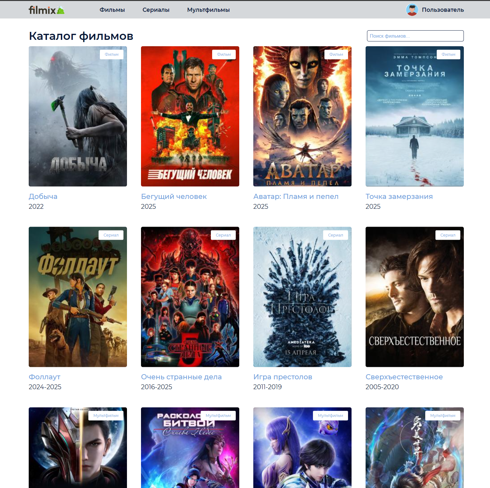
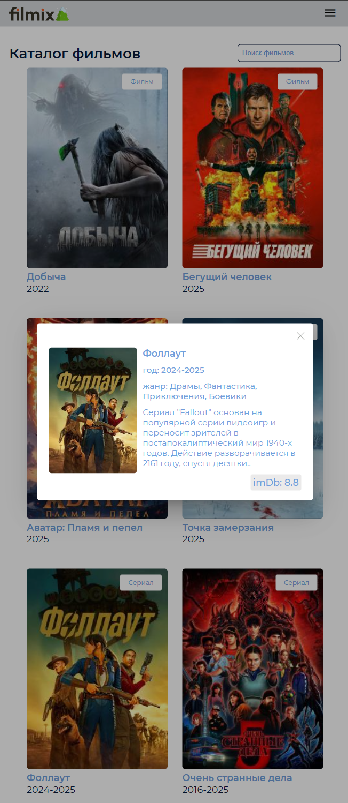

# Catalogfilms

This project was generated with [Angular CLI](https://github.com/angular/angular-cli) version 16.2.16.

Тестовое задание
- каталог фильмов
- backend json-server
- VPS: https://site079.podderzka-irk.ru/
(ubuntu 24, nginx, pm2, angular@16, ssl_certificate:Let's Encrypt)

|                    Скриншот 1                     |                    Скриншот 2                     |
|:-------------------------------------------------:|:-------------------------------------------------:|
|  |  |
|                *Главная страница*                 |                     *Адаптив*                     |

